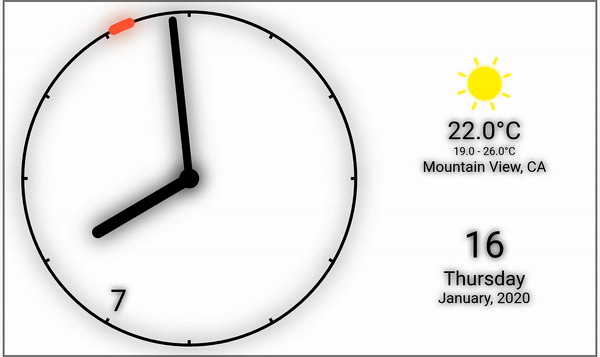
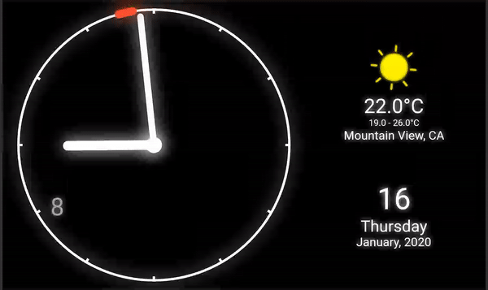

# Shadow Clock

This is my attempt at making clock from flutter.
It was build up by upon analog clock from [here](https://github.com/flutter/flutter_clock) and flutter clock

## Light theme design

## Dark theme design

## For installation 

    git clone https://github.com/flutter/flutter_clock.git
    cd flutter_clock
    git clone https://github.com/SirusCodes/Shadow-Clock.git
    cd Shadow-Clock
    flutter run
